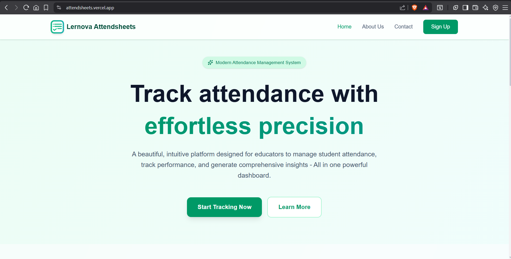
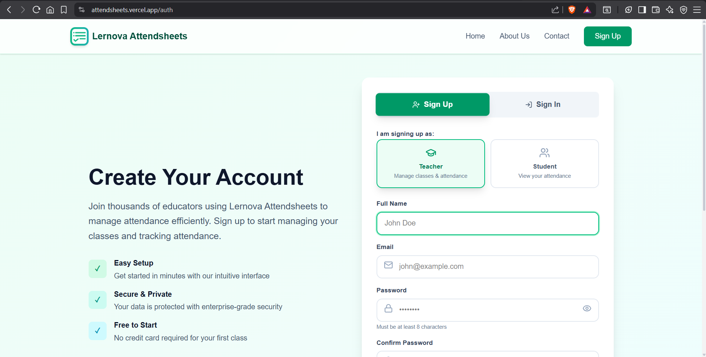
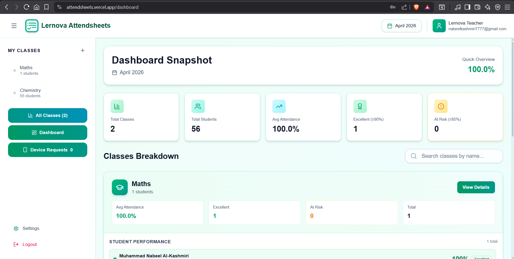
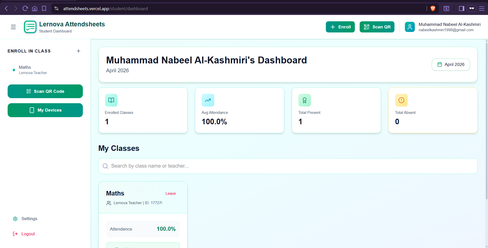
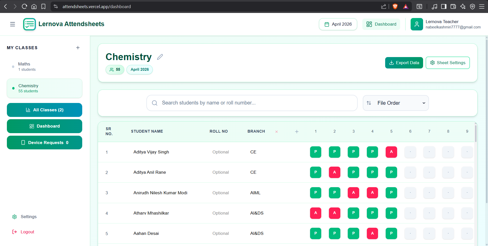
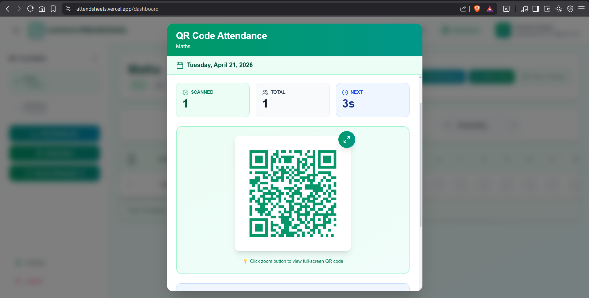
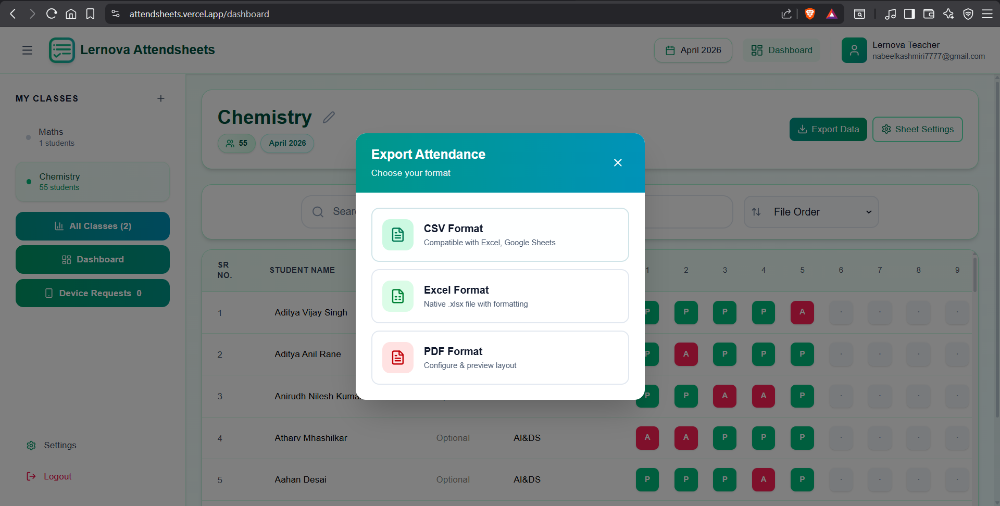

# Lernova Attendsheets

A full-stack attendance management platform built for classroom and coaching workflows.

This repository is a portfolio showcase. The production codebase is private because it contains startup-specific business logic, institution workflows, and deployment-sensitive configuration.

## Overview

Lernova Attendsheets was designed to reduce manual attendance work and improve visibility for both teachers and students.  
The product focuses on secure authentication, fast attendance capture, QR-based check-ins, and export-ready reporting.

## Core Features

- Teacher dashboard for attendance, class settings, and analytics
- Student dashboard for attendance visibility
- Session-wise attendance for multi-session class days
- QR-based attendance flow with rotating session codes
- Enrollment and class-join workflows
- Threshold-based class rules and settings
- CSV/Excel import and export support
- Email verification and password reset
- Device-aware login and session handling

## Tech Stack

### Frontend
- Next.js (App Router)
- React + TypeScript
- Tailwind CSS
- Framer Motion
- Utility libraries: `html5-qrcode`, `xlsx`, `papaparse`, `jspdf`

### Backend
- FastAPI (Python)
- JWT authentication
- Pydantic validation
- Storage abstraction for:
  - File-based mode (local/dev)
  - MongoDB mode (production-ready)
- Email workflows via Brevo SDK

## Architecture Snapshot

- `sheets-frontend/`: UI routes, dashboard modules, client utilities
- `sheets-backend/`: API layer, auth flows, data managers, attendance logic
- API modules cover authentication, classes, enrollment, attendance, QR session lifecycle, and profile/security flows

## Security and Privacy

- Password hashing with secure derivation
- JWT-based protected API access
- Environment-driven secrets and runtime config
- Configurable CORS allowlist
- Private source policy for operational security and data protection

## Why This Repository Is Limited

I am not allowed to publish the full production source publicly because this project is part of a startup product.

For interviews or technical discussions, I can share:

- Architecture walkthrough
- Sanitized code excerpts
- Product demo/screenshare
- Engineering decisions and tradeoff notes

## High-Level Local Run Flow

1. Start backend from `sheets-backend/` (FastAPI/Uvicorn)
2. Start frontend from `sheets-frontend/` (Next.js)
3. Configure environment variables for DB mode, JWT secret, CORS origins, and email provider

## Resume Context

This project demonstrates practical full-stack product engineering:

- Building production-oriented teacher/student workflows
- Designing secure auth and session flows
- Implementing real-world attendance operations with exports and QR-based capture
- Structuring a maintainable frontend-backend architecture

## UI Screenshots

### 1) Landing Page

### 2) Login

### 3) Teacher Dashboard

### 4) Student Dashboad

### 5) Attendance Marking

### 6) QR Attendance

### 7) Reports and Export

## Contact

If you would like a deeper technical review, feel free to reach out via GitHub, LinkedIn, Instagram, Email.
